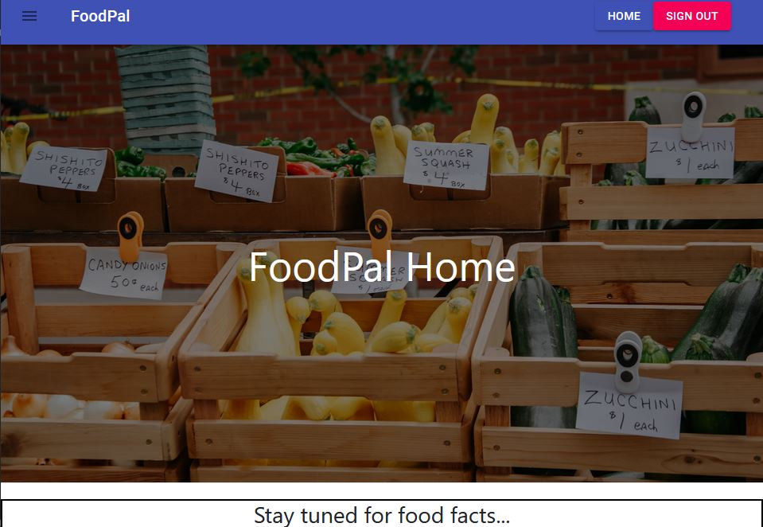

# FoodPal MERN App

 

## Project Description

~~ Under development ~~

A MERN application to deal with food education and tackle wastage. Allows the user to query a database for foods, and add those products to a tracking list. This list allows them to keep track of when they've go something stored at home, and when it is likely to expire, or at least reduce in quality.
We need to tackle wastage in the home, and the best way will be to provide users with clear information and easy methods of tracking to keep up with modern fast-paced lifestyles.

## Contents

- [User Story](#user-story)
- [Installation](#installation)
- [Requirements](#requirements)
- [Usage](#usage)
- [Demonstration](#demonstration)
- [Screenshots](#screenshots)
- [Future Direction](#future)
- [Questions](<#questions-(FAQ)>)
- [Contact](#contact)
- [Author](#authors)
- [Acknowledgements](#acknowledgements)

## User Story

`As a user, I want to search for an foods easily. I also want to be able to sort track these foods, updating some details, and track their expiry.`

## Installation

To install FoodPal:

1. Copy this repo to your local machine
2. Open a terminal window and navigate to the local directory.
3. Run `npm install` in the root and client directories.
4. Apply for a free account with [SendGrid](https://signup.sendgrid.com/)
5. Connect to a MongoDB via atlas, add a .env file for the connection string, sendgrid key, jwt secret and other process.env requirements.

- Alternatively, view deployed application below.

#### Requirements:

1. React.js
2. Node.js
3. Express
4. MongoDB

## Usage

1. Sign up for an account
2. Navigate with the drawer to my lists and begin tracking! (complete feature under development)

## Demonstration

- [Deployed Application](https://food-pal-v1.herokuapp.com/)

## Tests

- No included tests for this application.

## Screenshots

_Main dash for loading up_

_Dashboard changes, as do options once signed in_

_Drawer active with some options displayed_

_Main feature with working search filter, and current food choices uploaded to the database. Additional feature improvements to be made to the stored list_

## Future

- lazy loading or paginated food cards
- Thorough styling of all pages and elements (in-progress)
- Fixing list item manipulation (in-progress)
- include react-widgets for easier input of new expiry dates
- Admin console to approve new foods
- Tracking of other users lists
- Fixing major bugs (especially those pertaining to primary function)

## Questions

- Submit questions to my contact details below.
- App is hosted on Heroku.

## Contact

- Contact me with any questions on my email: agre.fun21@gmail.com or silver.grech@gmail.com

## Author

- Andr&eacute; Grech - 15/02/2021

### Acknowledgements

- © 2019 Trilogy Education Services, a 2U, Inc. brand. All Rights Reserved.
